# wg-autoconf 1.0.0-r1 Documentation

> Complete technical reference for `wg-autoconf`

---


1. [Architecture Overview](#1-architecture-overview)
2. [Execution Lifecycle](#2-execution-lifecycle)
3. [State Machine](#3-state-machine)
4. [Syntax and Naming Convention](#4-syntax-and-naming-convention)
5. [Routing System (Policy-Based)](#5-routing-system-policy-based)
6. [WireGuard Server Support](#6-wireguard-server-support)
7. [Firewall Integration](#7-firewall-integration)
8. [DNS Redirect](#8-dns-redirect)
9. [NFTables Integration](#9-nftables-integration)
10. [Atomic Operations and Backups](#10-atomic-operations-and-backups)
11. [C Optimised Modules](#11-c-optimised-modules)
12. [Boot Cleanup Service](#12-boot-cleanup-service)
13. [Multi-Interface Handling](#13-multi-interface-handling)
14. [Design Decisions and Notes](#14-design-decisions-and-notes)
15. [Performance Considerations](#15-performance-considerations)
16. [Troubleshooting](#16-troubleshooting)
17. [File Locations](#17-file-locations)
18. [Development Notes](#18-development-notes)

---

## 1. Architecture Overview

### System Components


`wg-autoconf` is a comprehensive WireGuard management tool for OpenWrt, built with a hybrid architecture combining Ash shell for flexibility and C for performance-critical operations.


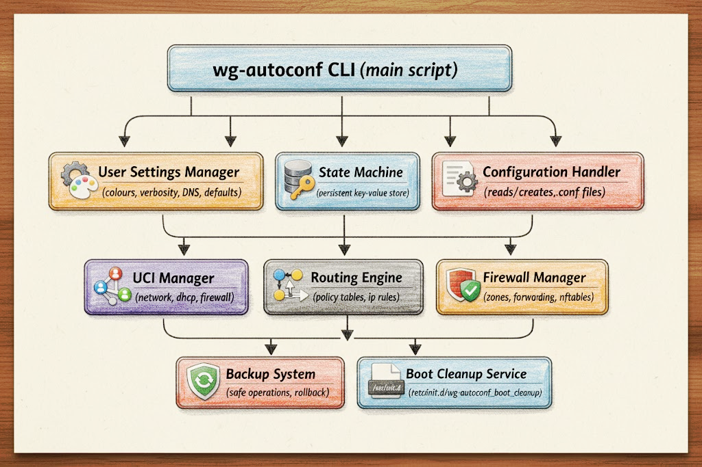


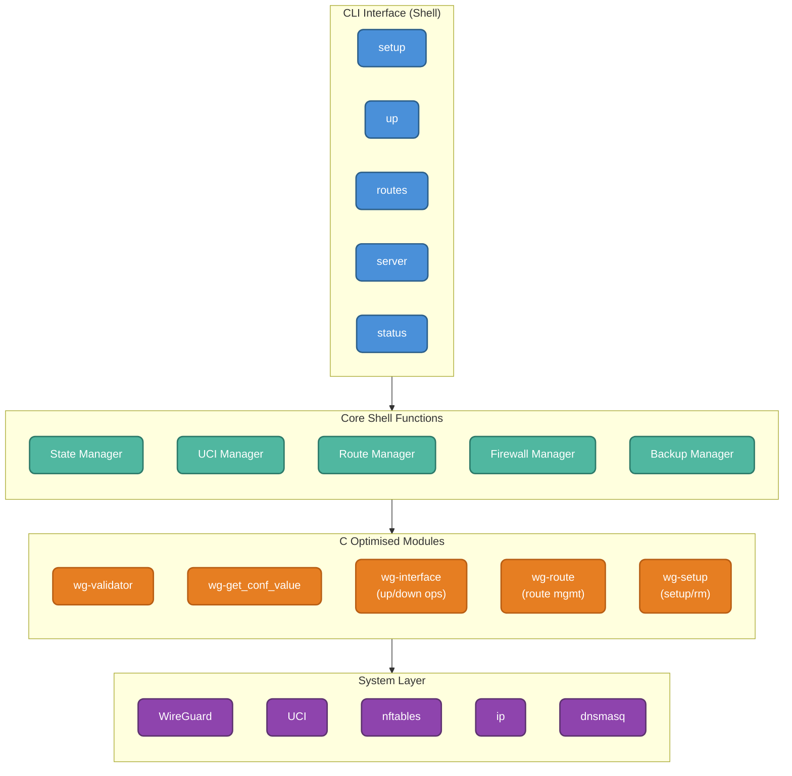

### Core Design Principles

- **Atomic Operations**: Every configuration change is atomic, preventing corruption
- **State Persistence**: All interface states are tracked across reboots and upgrades
- **Safety First**: Multiple validation layers and safe fallbacks
- **Performance**: C modules for critical operations (1000x speed improvement)
- **Zero Surprises**: Predictable behaviour with extensive logging

---

## 2. Execution Lifecycle

### Pipeline Overview

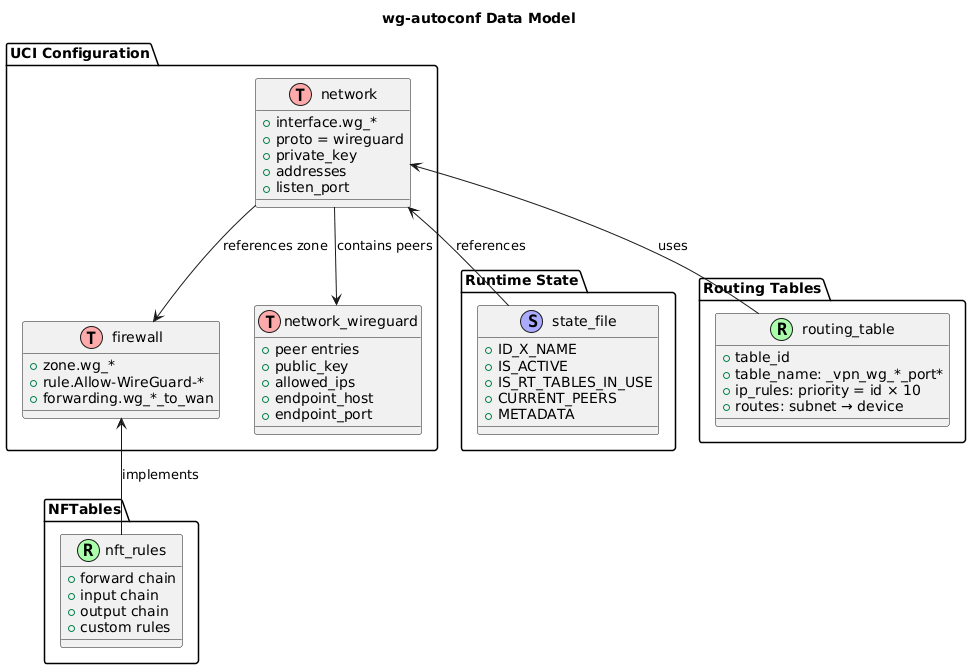

The lifecycle of a WireGuard interface follows a well-defined pipeline:

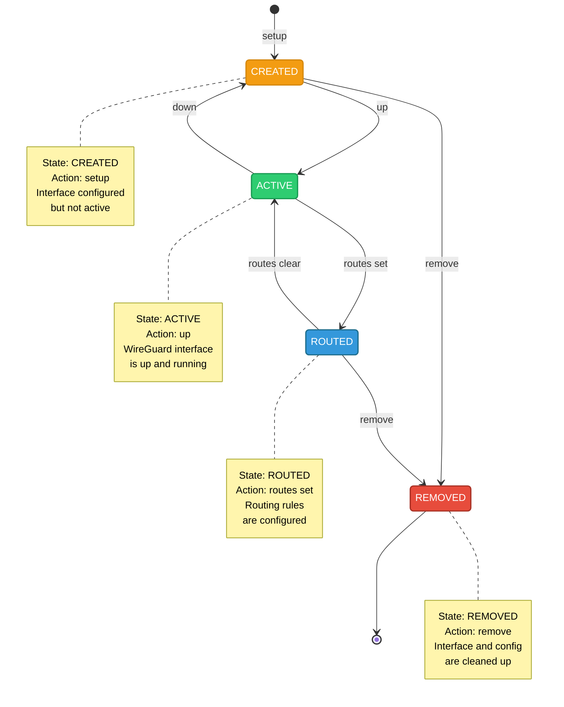

### Step 1: `wg-autoconf setup myconfig`

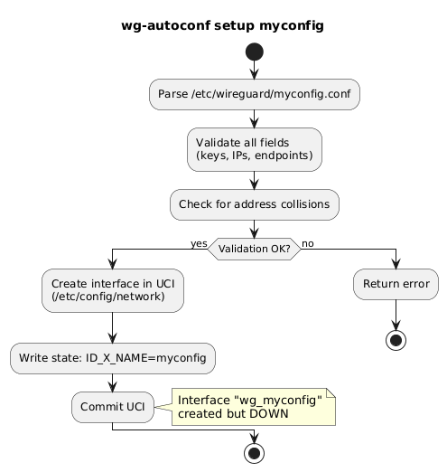

1. Parse the given `/etc/wireguard/myconfig.conf`
2. Validate all fields (keys, IPs, endpoints)
3. Check for collisions
4. Create interface in UCI (`/etc/config/network`)
5. Write state: ID_X_NAME=myconfig
6. Commit
- Result: Interface "wg_myconfig" created but **DOWN**


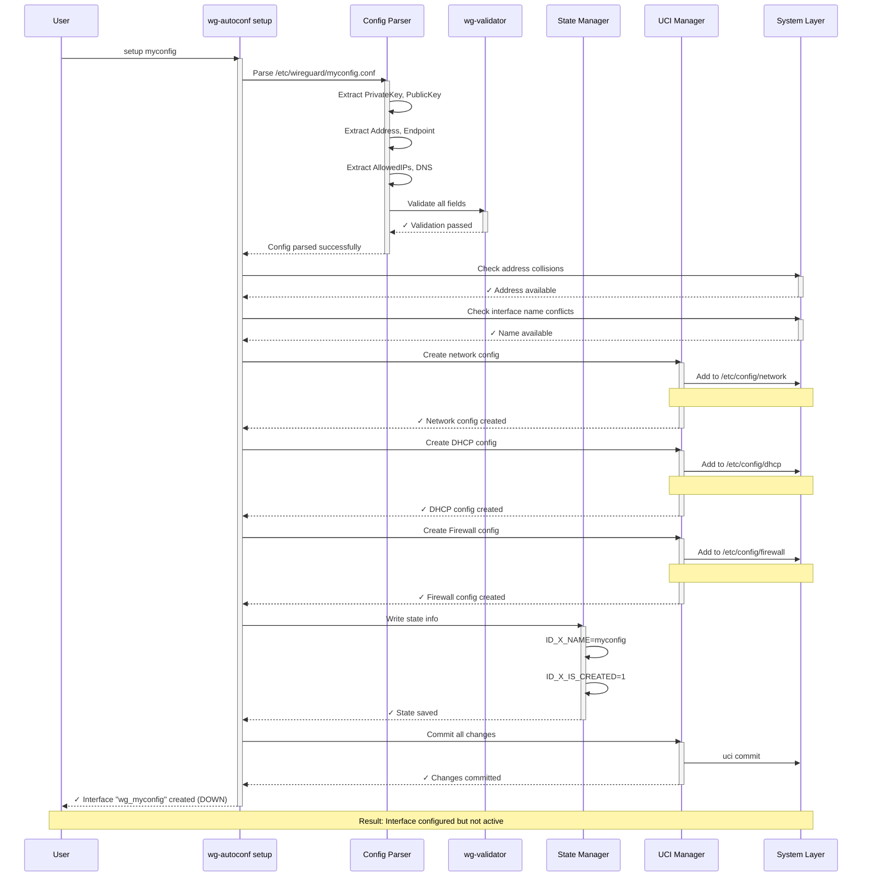

### Step 2: `wg-autoconf up wg_myconfig`

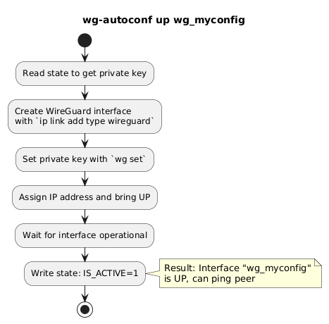

1. Read state to get private key
2. Create WireGuard interface with `ip link add type wireguard`
3. Set private key with `wg set`
4. Assign IP address and bring UP
5. Wait for interface operational
6. Write state: IS_ACTIVE=1

- Result: Interface "wg_myconfig" is UP, can ping peer


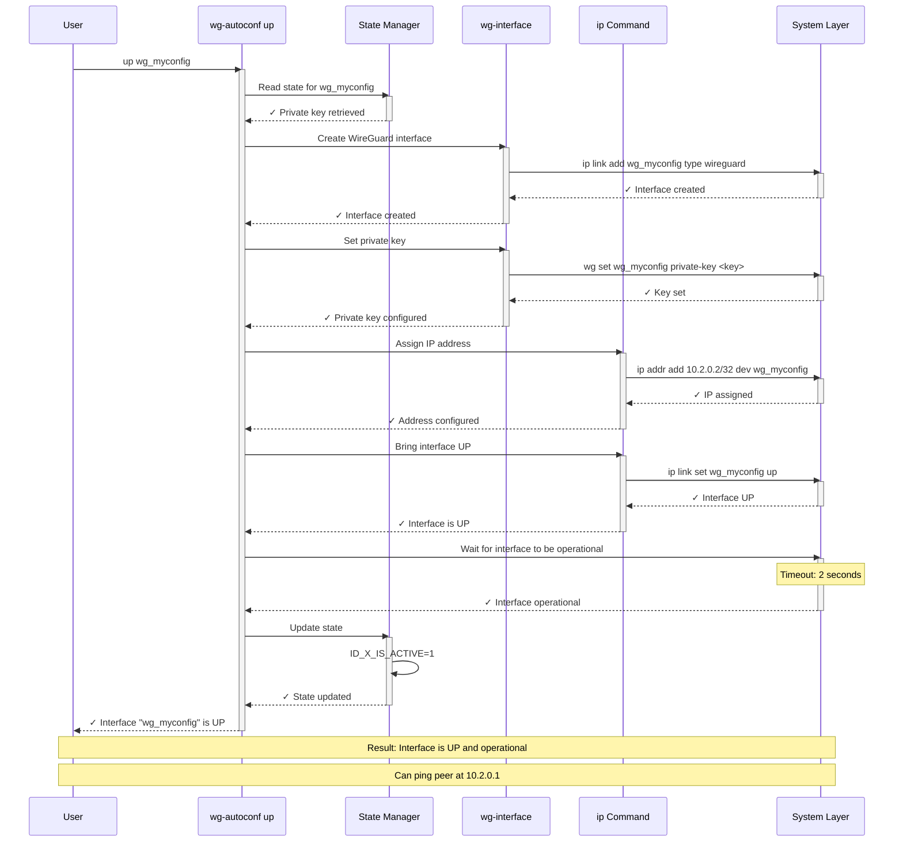

### Step 3: `wg-autoconf routes set wg_myconfig lan3`

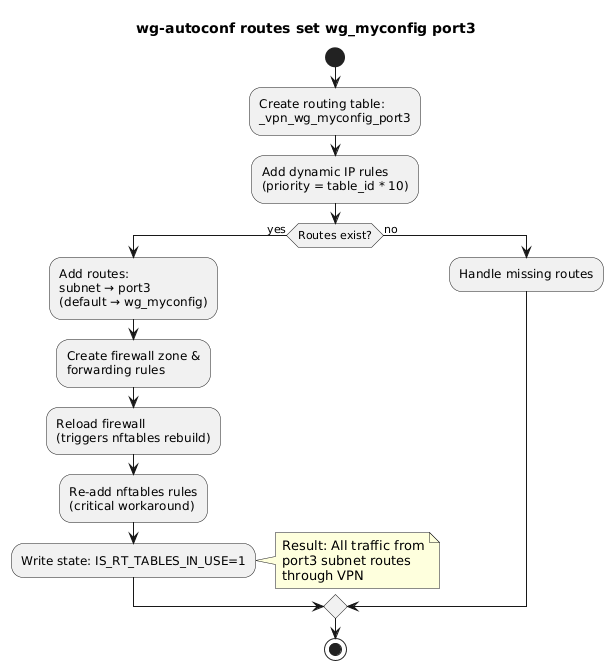

1. Create routing table: _vpn_wg_myconfig_lan3
2. Add dynamic IP rules (priority = table_id * 10)
3. Add routes: subnet → lan3, default → wg_myconfig
4. Create firewall zone & forwarding rules
5. Reload firewall (triggers nftables rebuild)
6. Re-add nftables rules (critical workaround)
7. Write state: IS_RT_TABLES_IN_USE=1

- Result: All traffic from port3 subnet routes through VPN


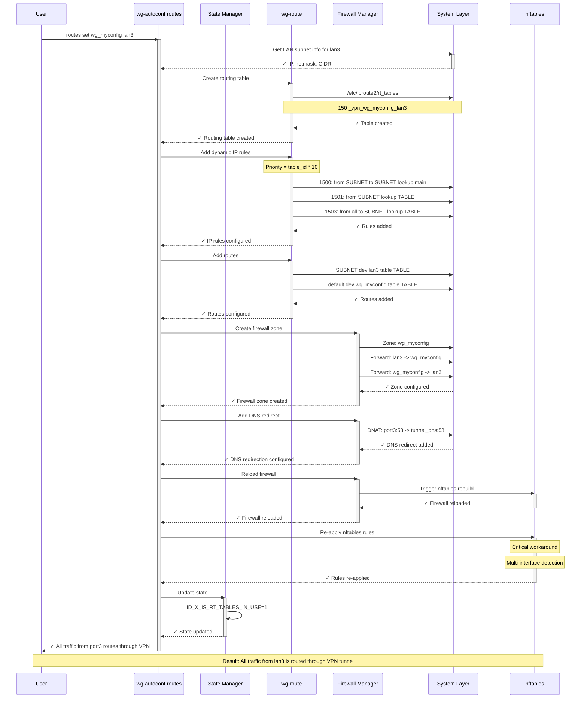

---

## 3. State Machine

### Purpose

Persistent storage that tracks the complete state of all WireGuard interfaces. The state machine enables:

- **Self-healing**: The tool knows exactly what state each interface should be in
- **Safe operations**: Prevents dangerous actions on interfaces in wrong states
- **Upgrade safety**: Tracks state across package upgrades
- **Disaster recovery**: Can recover from crashes and interrupted operations

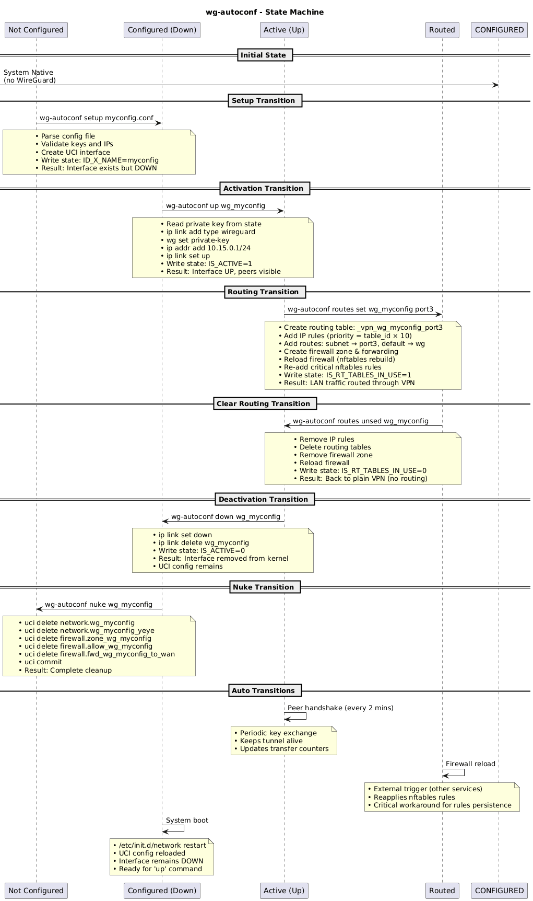


### State File Location

```
/usr/libexec/wg-autoconf/states
```

### State File Format

Key-value pairs, one per line:

```bash
# Global States
IS_INSTALLED=1              # Package installed
IS_FIRST_EXEC=1             # First execution after install/nuke
IS_PREV_TO_UPGRADE=0        # Pre-upgrade state flag
IS_UPGRADED=0               # Post-upgrade state flag

# Per-Interface States
ID_1_NAME=wg_home           # Interface name
ID_1_IS_CREATED=1           # Config created in UCI
ID_1_IS_ACTIVE=1             # Interface is up/running
ID_1_IS_RT_TABLES_IN_USE=1  # Routing tables configured

ID_2_NAME=wg_work
ID_2_IS_CREATED=1
ID_2_IS_ACTIVE=0
ID_2_IS_RT_TABLES_IN_USE=0
```

### State Operations

```bash
# Write (creates or updates)
state_write "ID_1_NAME" "wg_home"

# Read value
value=$(state_read "ID_1_NAME")

# Check existence
if state_read "ID_1_NAME" >/dev/null 2>&1; then
    # exists
fi

# Get interface ID from name
id=$(state_get_id "wg_home")

# List all interfaces
state_list_ifaces
# Returns: "1:wg_home 2:wg_work"

# Count interfaces
state_count_ifaces
# Returns: 2

# Remove interface from state
state_remove_iface "1"

# Reset entire state (nuke)
state_reset
```

### Atomic File Operations

```bash
state_write() {
    # 1. Create unique temp file (uses atomic counter)
    temp_file="${ATOMIC_PATHS}/states.write.${counter}.atomic"

    # 2. Read entire state file
    # 3. Find key and replace OR append
    # 4. Write to temp

    # 5. Verify temp is not empty (critical!)
    if [ ! -s "$temp_file" ]; then
        # Temp empty = write failed
        return 1
    fi

    # 6. Atomic move (mv is atomic on same filesystem)
    mv "$temp_file" "$STATE_FILE"
}
```

**Why Atomic?** Prevents corruption if write fails mid-operation (power loss, interrupt).  While many file operations (as `sed`, `awk`) use to be 'atomics by default', a three-stages approach (read each write reads entire file, modifies in memory, writes atomically) prevents partial writes or corruption.

---

## 4. Syntax and Naming Convention

### Design Principles

- **One name to rule them all**: The interface name (`wg_*`) is the only identifier the user needs
- **Derived naming**: All other names derive automatically from the interface name
- **No device names**: Works with interface names, not low-level device names
- **Predictable patterns**: Easy scripting and debugging
- **Collision avoidance**: Prefixes (`_vpn_`) and suffixes prevent conflicts
- **Self-documenting**: Names describe their purpose

### Interface Names

| Mode | Format | Examples |
|---|---|---|
| Setup (Auto) | `wg_<conf_filename>` | `wg_home`, `wg_work` |
| Manual | `wg<any_name>` | `wg0`, `wgVPN1` |
| Server | `wg_server_<name>` | `wg_server_myvpn` |

**Rules:**

- Lowercase, alphanumeric, underscores allowed
- No hyphens (not allowed by WireGuard)
- Must start with `wg`
- Cannot be just `wg`
- Max 15 characters

### Derived Names

```
Interface:    wg_home
Interface ID: 1

Routing Table: _vpn_wg_home_port3
Firewall Zone: wg_home
UCI Section:   network.wg_home
Peer Config:   wg_home_peer
Peer Name:     wg_home_phone
```

### Routing Tables

```
_vpn_<interface>_<lan_interface>
```

Examples:

- `_vpn_wg_home_port3`
- `_vpn_wg_work_br-lan`
- `_vpn_wg_server_myvpn_lan4`

### IP Rule Priorities

```
<table_id> × 10
```

Example: Table ID 150 → priority 1500

Rule Priorities:

- **base**: Local traffic (SUBNET → SUBNET)
- **base+1**: Outbound traffic (SUBNET → TABLE)
- **base+3**: Return traffic (all → SUBNET)

### Firewall Zones

```
wg_<interface>
```

Examples:

- `wg_home`
- `wg_work`
- `wg_server_myvpn`

---

## 5. Routing System (Policy-Based)

### Why Policy-Based Routing?

Not full tunnel. Selective routing per LAN. You can:

- Route specific LANs through VPN, keep others on WAN
- Route multiple LANs through different VPNs
- Dynamically add/remove routes without affecting other traffic
- Route `wg1` to `lan4`, unroute it, route it to `lan2`
- Route `wg3` to `lan4` and also to `lan1`

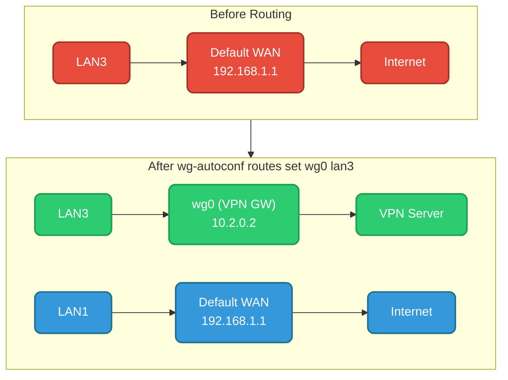

### IP Rules Priority System

Each LAN route uses 3 rules:

```bash
# Example: Table ID 150 (base priority 1500)

# Rule 1: Local traffic (base)
from 192.168.3.0/24 to 192.168.3.0/24 lookup main
# Allows devices in subnet to communicate directly

# Rule 2: Outbound traffic (base+1)
from 192.168.3.0/24 lookup _vpn_wg_home_port3
# Routes traffic from LAN through VPN

# Rule 3: Return traffic (base+3)
from all to 192.168.3.0/24 lookup _vpn_wg_home_port3
# Ensures responses go back through same VPN
```

### Dynamic Table ID Allocation

**Challenge**: Multiple WG interfaces need unique routing tables. Table IDs must be numeric and unique.

**Solution**: Auto-allocate from 150-249. Table ID × 10 = rule priorities.

```bash
# Example: 3 interfaces with tables 150, 151, 200

Table 150 (first LAN VPN):
  Priority 1500: from 192.168.3.0/24 to 192.168.3.0/24 lookup main
  Priority 1501: from 192.168.3.0/24 lookup _vpn_wg_home_port3
  Priority 1503: from all to 192.168.3.0/24 lookup _vpn_wg_home_port3

Table 151 (second LAN VPN):
  Priority 1510: from 192.168.4.0/24 to 192.168.4.0/24 lookup main
  Priority 1511: from 192.168.4.0/24 lookup _vpn_wg_work_port4
  Priority 1513: from all to 192.168.4.0/24 lookup _vpn_wg_work_port4

Table 200 (client-side routing):
  Priority 2000: from 10.2.0.2 lookup wg_home
  Priority 2001: from all to 10.2.0.2 lookup wg_home
```

### Routing Table Persistence

```bash
# Tables stored in /etc/iproute2/rt_tables:
150 _vpn_wg_home_port3
151 _vpn_wg_work_port4
200 wg_home
201 wg_work

# Added on: routes set command
# Removed on: routes unset or remove commands
# Cleanup on: Boot cleanup service (if enabled)
```

### Testing VPN Routes

```bash
# Test VPN connectivity
traceroute -i wg_home openwrt.org
curl --interface wg_home ifconfig.me
ping -I wg_home 1.1.1.1

# Check status
wg-autoconf status
wg show wg_home
```

---

## 6. WireGuard Server Support

### Architecture

Supports multiple independent WireGuard servers, each with multiple clients.

```
wg_server_myserver (10.99.0.0/24)
  |
  ├─→ client1 (10.99.0.2)
  ├─→ client2 (10.99.0.3)
  └─→ client3 (10.99.0.4)

wg_server_work (10.98.0.0/24)
  |
  ├─→ emp_user1 (10.98.0.2)
  └─→ emp_user2 (10.98.0.3)
```

### State Storage

Servers use the same state format as normal interfaces:

```
ID_1_NAME=wg_server_myserver
ID_1_IS_CREATED=1
ID_1_IS_ACTIVE=1
ID_1_IS_RT_TABLES_IN_USE=0

# Server-specific metadata stored in separate config
# /usr/libexec/wg-autoconf/configs/myserver/server.conf
```

### Server Workflow

```bash
# 1. CREATE SERVER (interactive)
wg-autoconf server create
    # Asks: name, subnet, DNS, port, endpoint
    # Generates: server keypair
    # Creates: UCI interface + firewall zone
    # Creates: /usr/libexec/wg-autoconf/configs/<name>/server.conf

# 2. ADD USER
wg-autoconf server add myserver client1
    # Generates: client keypair
    # Assigns: next available IP (10.99.0.2)
    # Adds peer to WireGuard (via wg set)
    # Generates: /usr/libexec/wg-autoconf/configs/myserver/client1.conf

# 3. DISTRIBUTE CONFIG
    # User imports .conf to WireGuard app
    # Device connects → handshake with server

# 4. REVOKE USER (with confirmation)
wg-autoconf server revoke myserver client1
    # Removes peer from WireGuard
    # Deletes .conf file
    # Updates state

# 5. REMOVE SERVER (auto-revokes all users)
wg-autoconf server remove myserver
    # Revokes all users
    # Removes UCI interface + firewall zone
    # Cleans state entirely
    # Deletes /usr/libexec/wg-autoconf/configs/myserver/
```

### Design Decisions

| Decision | Reason |
|---|---|
| Single WireGuard per Server | Independent firewall zones, different listen ports, cleaner address space |
| Auto IP Assignment | No manual coordination, prevents collisions, simple UX |
| Stored Private Keys | Can regenerate `.conf` files, client reconfiguration without re-running setup |
| Endpoint in State | Supports DNS names, different from server name |
| Per-Server Config Directory | Isolated configurations per server |

---

## 7. Firewall Integration

### Zone Creation

When `routes set wg0 lan3` is called, creates in `/etc/config/firewall`:

```bash
config zone
    option name 'wg_home'
    option input 'ACCEPT'
    option output 'ACCEPT'
    option forward 'ACCEPT'
    option masq '1'
    option mtu_fix '1'
    list network 'wg_home'

config rule
    option name 'Allow-WireGuard-wg_home'
    option src 'wan'
    option dest_port '51820'
    option proto 'udp'
    option target 'ACCEPT'

config forwarding
    option src 'lan3'
    option dest 'wg_home'

config forwarding
    option src 'wg_home'
    option dest 'lan3'
```

### Why Bidirectional Forwarding?

```bash
# Rule 1: Allows packets from LAN3 to enter VPN (outbound)
config forwarding
    option src 'lan3'
    option dest 'wg_home'

# Rule 2: Allows responses from VPN back to LAN3 (inbound)
config forwarding
    option src 'wg_home'
    option dest 'lan3'
```

Both required for bidirectional communication, even in a "default INPUT/FORWARD DROP/REJECT" scenario.

### Firewall Tagging

All firewall modifications are wrapped in tagged blocks for safe removal:

```bash
# wg-autoconf firewall start id 1
config zone
    option name 'wg_home'
    ...

config forwarding
    option src 'lan3'
    option dest 'wg_home'
# wg-autoconf firewall end id 1
```

This allows surgical removal without affecting manual firewall rules.

---

## 8. DNS Redirect

### Overview

When routing is configured, `wg-autoconf` automatically adds DNAT rules to redirect DNS queries from the LAN to the VPN's DNS server.

### Implementation

```bash
# Example rule added to /etc/config/firewall:
config redirect
    option name 'Redirect_DNS_lan3_to_wg_home'
    option src 'lan3'
    option proto 'tcp udp'
    option src_dport '53'
    option dest_ip '10.2.0.1'
    option dest_port '53'
    option target 'DNAT'
```

### Benefits

- **Prevents DNS Leaks**: All DNS queries go through VPN tunnel
- **Automatic Configuration**: No manual DNS setup needed
- **Interface Specific**: Only affects routed LANs
- **Clean Removal**: Removed when `routes unset` is called

### Removal

When `routes unset` is called, the DNS redirect rule is automatically removed:

```bash
# The redirect rule is removed atomically with other cleanup
wg-autoconf routes unset wg_home lan3
# Removes: DNS redirect, routing table, firewall rules, IP rules
```

### DNS Leakage Notice

`wg-autoconf` includes a DNS leakage warning system:

```bash
# When setting up, warns about potential DNS issues
wg-autoconf setup myvpn
# > [WARNING] DNS Security Note about '1.1.1.1, 1.0.0.1'
# > POTENTIAL DNS LEAK DETECTED
# > You're using your local VPN IP as DNS server
```

---

## 9. NFTables Integration

### The Challenge

OpenWrt uses NFTables for firewall. When you reload firewall config:

1. Reads all `/etc/config/firewall` rules
2. Generates new nftables ruleset
3. Clears all existing nftables chains
4. Applies new ruleset

**Problem**: Custom rules added by `wg-autoconf` are lost.

### The Solution

After every firewall reload, `wg-autoconf` re-applies all necessary nftables rules using the `fw_reload_with_wg_detection()` function:

```bash
# In set_lan_routes() and fw_reload_with_wg_detection():
for wg_iface_loop in $(grep "^[0-9]\+ wg" /etc/iproute2/rt_tables | awk '{print $2}'); do

    # Re-add accept rules
    nft add rule inet fw4 "accept_from_$wg_iface_loop" counter accept 2>/dev/null
    nft add rule inet fw4 "accept_to_$wg_iface_loop" counter accept 2>/dev/null

    # Re-add srcnat jump (critical for masquerading)
    nft add rule inet fw4 srcnat oifname "$wg_iface_loop" jump "srcnat_${wg_iface_loop}" 2>/dev/null
done
```

### Multi-Interface Detection

Critical for multiple WG clients + servers:

```bash
# Detect from rt_tables (server interfaces)
grep "^[0-9]\+ wg" /etc/iproute2/rt_tables

# Detect from ip link (client interfaces)
ip link show | grep '^[0-9]*:.*wg'

# Combine both
all_wg_interfaces=$(...)
```

Why both sources?

- `rt_tables` has all server tables
- `ip link` shows only active interfaces
- Combining ensures no missed interfaces

---

## 10. Atomic Operations and Backups

### Why Atomic?

Prevents corrupted configs if operation fails mid-way (power loss, user interrupt).

```
Without atomic ops:
  wg-autoconf up wg0
    > Create interface
    > Set private key  <---- POWER LOSS HERE
        > [Never reaches] Set IP address
        > [Never reaches] Activate

  Result: Broken state, partial config in /etc/config/

With atomic ops:
  wg-autoconf up wg0
    > Create temp /etc/config/network.tmp
    > Read current /etc/config/network
    > Modify in memory
    > Write all at once to .tmp
    < Verify .tmp not empty
    > Atomic rename .tmp --> network (single OS call)
    > If any step fails, .tmp deleted, original untouched
```

### Tagging In-Use Blocks

Each modification wrapped in comments:

```bash
# wg-autoconf network start id 1
config interface 'wg_home'
    option proto 'wireguard'
    option private_key 'eMD4...'
    option addresses '10.2.0.2/32'
# wg-autoconf network end id 1
```

Benefits:

- Surgical removal (only tagged blocks deleted)
- Multiple simultaneous setups (unique IDs per config)
- Manual edits survive cleanup
- Emergency recovery: `grep "wg-autoconf" /etc/config/*`

### Backup Files

```bash
# Backup files (one per config):
/etc/config/network.BACKUP_PRE_WIREGUARD
/etc/config/dhcp.BACKUP_PRE_WIREGUARD
/etc/config/firewall.BACKUP_PRE_WIREGUARD
```

Content:

```
# WG_AUTOCONF_BACKUP_1.0.0-r1_1708457600
<original file contents>
# WG_AUTOCONF_CHECKSUM: abc123def456...
```

**Checksum**: SHA256 of content (without markers). Validates integrity on restore.

### Backup Operations

```bash
# List available backups
wg-autoconf backups show

# Restore latest backups
wg-autoconf backups restore

# Restore specific backup
wg-autoconf backups restore network

# Diagnose backup issues
wg-autoconf backups diag network
wg-autoconf backups diag firewall

# Clean up valid backups
wg-autoconf backups cleanup
```

---

## 11. C Optimised Modules

### Overview

`wg-autoconf` 1.0.0-r1 includes native C modules for performance-critical operations.

### Module List

| Module | Function | Benefit |
|---|---|---|
| `wg-validator` | Configuration validation | 1000x faster than shell |
| `wg-get_conf_value` | Parsing `.conf` files | Optimised file reading |
| `wg-interface` | Interface control (up/down) | Atomic operations, faster |
| `wg-route` | Routing management | 1000x speed improvement |
| `wg-setup` | Setup and removal | Transaction-safe operations |

### Architecture

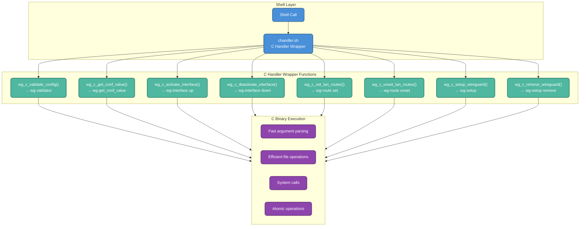

### Fallback System

If C binaries are not available (e.g., during development):

```bash
# chandler.sh checks for C binaries
if [ -f "$WG_VALIDATOR_BIN" ] && [ -x "$WG_VALIDATOR_BIN" ]; then
    HAS_WG_VALIDATOR="yes"
else
    # Automatic fallback to shell functions
    HAS_WG_VALIDATOR="no"
fi

# Each C function has a shell fallback
wg_c_validate_config() {
    [ "$HAS_WG_VALIDATOR" != "yes" ] && return 1
    # ... C execution ...
}
```

---

## 12. Boot Cleanup Service

### Purpose

Remove stale WireGuard configs on boot. Prevents orphaned interfaces and broken routing.

### Behaviour

On each boot (BEFORE network startup finishes):

1. Read state file
2. Find all WireGuard interfaces
3. Remove UCI configs (network + firewall)
4. Flush routing tables
5. Remove `rt_tables` entries
6. Reset state file

### Why Aggressive?

Even though it can be executed at any time with the `nuke` command, even that name poses no danger whatsoever.

By design, it is preferred to leave a clean system with no garbage or remnants of old or unwanted configurations, to avoid disaster (having to perform a hard brick).

After power loss or crash:

- Partial configs might exist
- Routing tables might have stale rules
- Firewall rules might be orphaned
- DNS might be broken

For all possible disaster scenarios, it's safer to clear everything and let users manually recreate than to leave a broken state.

### Service Location

```
/etc/init.d/wg-autoconf_boot_cleanup
```

### Disabling

```bash
/etc/init.d/wg-autoconf_boot_cleanup disable
```

**Trade-off**: You become responsible for manual cleanup after crashes.

### Emergency Fallback

If the main binary is not found, the boot service includes an emergency fallback:

```bash
# Emergency cleanup when wg-autoconf binary not found
# 1. Remove WireGuard interfaces from ip link
# 2. Clean WireGuard configurations from UCI
# 3. Clean routing tables
# 4. Restore configuration backups
# 5. Commit UCI changes
# 6. Clean state and debug files
```

---

## 13. Multi-Interface Handling

### Multiple Clients + Multiple Routes

**Problem**: When routing two clients to different LANs, firewall reload would clear NFTables rules for first client, causing connectivity loss.

**Root Cause**: `set_lan_routes()` only re-added nftables rules for the current interface, not all WG interfaces.

**Solution**: After firewall reload, iterate ALL wg interfaces (not just current) and re-add rules:

```bash
# OLD (broken):
nft add rule inet fw4 srcnat oifname "$wg_iface" jump "srcnat_$wg_iface"

# NEW (fixed):
for wg_iface_loop in $(grep "^[0-9]\+ wg" /etc/iproute2/rt_tables | awk '{print $2}'); do
    nft add rule inet fw4 srcnat oifname "$wg_iface_loop" jump "srcnat_${wg_iface_loop}"
done
```

### Multi-Server Support

Each server is independent:

```bash
wg-autoconf server create A
wg-autoconf server create B
wg-autoconf up wg_server_A
wg-autoconf up wg_server_B

# Now both servers listening on different ports
# Clients can connect to either
```

No port conflicts because each server has unique `LISTEN_PORT`.

### Multiple VPN Example

```bash
# Setup both VPNs
wg-autoconf setup us-vpn
wg-autoconf setup eu-vpn
wg-autoconf up wg_us-vpn
wg-autoconf up wg_eu-vpn

# Route LAN3 through US VPN
wg-autoconf routes set wg_us-vpn port3

# Route LAN4 through EU VPN
wg-autoconf routes set wg_eu-vpn port4

# Verify
wg-autoconf status
wg-autoconf routes show
```

---

## 14. Design Decisions and Notes

### CLI Colours

```bash
# DEBUG! rel5
# TODO: Test colours/escapes in older devices, different shells
# REASON: Different ANSI colour interpretation for older shells
```

**Decision**: Keep colours but make them configurable.

```bash
# Disable colours if needed
wg-autoconf settings set colours 0
```

### POSIX Compliance

```bash
# DEBUG! r7
# Unified syntax: Ternaries, Arrays destructuring, echo/read -p vs printf
# POSIX → Test on many different Busybox-Ash shells
```

**Decision**: Use `&&` / `||` for ternaries instead of `$(... && echo ...)`.

```bash
# BAD (not POSIX)
result=$([ -z "$x" ] && echo "empty" || echo "full")

# GOOD (POSIX, works everywhere)
[ -z "$x" ] && result="empty" || result="full"
```

### Atomic Operations

```bash
# Use atomic file handling to prevent corruption
# Each operation: read entire state → modify → write atomically
# Prevents partial writes if operation interrupted
```

**Trade-off**: Slightly slower (reads full file each time) but prevents corruption.

### Boot Cleanup Lifecycle

```bash
# Boot cleanup is AGGRESSIVE
# Removes ALL WireGuard configs on each boot
# Trade-off: Prevents orphaned interfaces but requires manual recreation
```

Why aggressive? After crash, better safe than sorry.

### Tagging Strategy

```bash
# Tagged config blocks for surgical removal
# Each wg-autoconf modification wrapped in:
# # wg-autoconf <type> start id <N>
# ... actual config ...
# # wg-autoconf <type> end id <N>
```

Why? Allows removal of specific configs without touching manual edits. Essential for multi-interface support.

### DNS Leakage Notice

```bash
# DNS Leakage Warning Helper
dns_leakage() {
    # Advises user about potential DNS issues
    # Cases:
    # 1. DNS = Local Address (without CIDR) - possible provider DNS
    # 2. DNS in private/tunnel IP range
    # 3. Unknown/insecure DNS
    # Shows warnings, DOES NOT modify configuration
}
```

---

## 15. Performance Considerations

### Slow Operations

| Operation | Time | Notes |
|---|---|---|
| Boot cleanup | ~2-5 seconds | Iterates all interfaces |
| Firewall reload | ~1-2 seconds | Rebuilds all NFTables chains |
| Routes set | ~1-2 seconds | Includes firewall reload |
| Multiple routes set | Seconds per route | Each causes firewall reload |

### Batch Operations

```bash
# Slow (3 firewall reloads):
wg-autoconf routes set wg0 lan3
wg-autoconf routes set wg0 lan4
wg-autoconf routes set wg1 lan5

# Can't really parallelise firewall, but at least do in single pass internally
# (Current implementation reloads per route, will be optimised)
```

### Optimisation Tips

```bash
# Disable debug if not needed (debug adds overhead)
wg-autoconf debug off

# Disable boot cleanup if not needed
/etc/init.d/wg-autoconf_boot_cleanup disable
# Only if you won't be crashing and know/have manual cleanup

# Use C modules (automatic, 1000x speed improvement)
# C modules enabled by default when available
```

### Performance Features

- **C Modules**: 1000x performance improvement over pure shell
- **Atomic Operations**: Safe but slightly slower
- **State Caching**: State file read once per operation
- **Tagged Blocks**: Quick surgical removal without full file scan

---

## 16. Troubleshooting

### State File Corruption

**Symptoms:**

- Commands fail with "state file not found" errors
- State reads don't work

**Diagnosis:**

```bash
# Check file permissions
ls -la /usr/libexec/wg-autoconf/states

# Check contents
head -20 /usr/libexec/wg-autoconf/states

# Validate key-value format
grep "^[A-Z_]*=" /usr/libexec/wg-autoconf/states | wc -l
```

**Fix:**

```bash
# Reset state
rm -f /usr/libexec/wg-autoconf/states
wg-autoconf status  # Recreates empty state
```

### Routing Table Overflow

**Symptoms:**

- "Cannot allocate routing table ID" errors
- Can't add more VPN routes

**Diagnosis:**

```bash
cat /etc/iproute2/rt_tables | wc -l
# System limit is usually 256 tables

# Check for duplicates
sort /etc/iproute2/rt_tables | uniq -d
```

**Fix:**

```bash
# Remove unused tables manually
# Edit /etc/iproute2/rt_tables
# Delete lines for deleted interfaces

# Or nuclear option:
wg-autoconf nuke
# (Removes everything, clean slate)
```

### IP Rule Orphaning

**Symptoms:**

- Firewall rules exist in nftables but `ip rule show` empty
- OR `ip rule show` has orphaned rules

**Diagnosis:**

```bash
# View all rules
ip rule show

# Find orphaned rules
for prio in $(ip rule show | grep -o '^[0-9]*:' | cut -d: -f1); do
    table=$(ip rule show from all prio "$prio" | grep -o 'lookup [^ ]*' | awk '{print $2}')
    [ -z "$table" ] && echo "Orphaned rule prio $prio"
done
```

**Fix:**

```bash
# Delete orphaned rules manually
ip rule del prio 1500
ip rule del prio 1501

# Or clean all (CAREFUL):
ip rule flush
# (Resets to system defaults, need to re-setup routes)
```

### NFTables Rules Missing

**Symptoms:**

- Traffic stops after firewall reload
- `nft list ruleset` shows no wg-autoconf rules

**Diagnosis:**

```bash
# Check if rules exist
nft list ruleset | grep wg
nft list ruleset | grep srcnat
```

**Fix:**

```bash
# Recreate rules by re-running routes set
wg-autoconf routes set wg_home lan3

# Or full re-setup
wg-autoconf remove wg_home
wg-autoconf setup home
wg-autoconf up wg_home
wg-autoconf routes set wg_home lan3
```

### DNS Issues on VPN

**Symptoms:**

- IP connectivity works but DNS queries fail
- `ping 8.8.8.8` works but `ping google.com` fails

**Diagnosis:**

```bash
# Check if DNS set on interface
uci show network.wg_home.dns

# Test with specific DNS
dig @1.1.1.1 google.com

# Check DNS redirect
uci show firewall | grep redirect | grep -i dns
```

**Fix:**

```bash
# Set DNS explicitly
uci set network.wg_home.dns='1.1.1.1 8.8.8.8'
uci commit network
ifup wg_home

# Or globally
wg-autoconf settings set dns "1.1.1.1, 8.8.8.8"

# Check DNS redirect
wg-autoconf routes set wg_home lan3  # Re-adds DNS redirect
```

### Interface Won't Come Up

```bash
# Validate configuration
wg-autoconf test myconfig

# Enable debug
wg-autoconf debug on
wg-autoconf up wg_myconfig --verbose
wg-autoconf debug show

# Check system logs
logread | grep wg-autoconf
```

### Routes Configured But No Traffic

```bash
# Verify routing table exists
ip route show table _vpn_wg_home_port3

# Check IP rules
ip rule show

# Verify interface is UP
wg show wg_home

# Check firewall zones
uci show firewall | grep wg_home

# Check nftables rules
nft list chain inet fw4 accept_to_wg_home
```

### Address Already In Use

```bash
# Find which interface has the IP
grep -r "10.2.0.2" /etc/config/network

# List all active interfaces
wg-autoconf status

# Use different IP in config file
# Edit /etc/wireguard/home.conf
# Change Address to new IP
# Re-setup: wg-autoconf setup home
```

### Restore From Broken State

```bash
# View available backups
wg-autoconf backups show

# Restore latest
wg-autoconf backups restore

# If that fails, nuke and restart
wg-autoconf nuke
```

### Debug Commands

```bash
# Enable debug
wg-autoconf debug on

# Show debug log
wg-autoconf debug show

# Live tail
wg-autoconf debug live

# View state
wg-autoconf debug states

# View network config
wg-autoconf debug network

# View firewall config
wg-autoconf debug firewall

# View routing tables
wg-autoconf debug tables
```

---

## 17. File Locations

### Configuration Files

```
/etc/wireguard/*.conf                            # WireGuard config files

/etc/config/network                              # Network interface configuration
/etc/config/firewall                             # Firewall configuration
/etc/config/dhcp                                 # DHCP/DNS configuration

/etc/iproute2/rt_tables                          # Routing tables
```

### Runtime Files

```
/usr/libexec/wg-autoconf/
├── states                                        # State machine file
├── user_settings                                 # User configuration overrides
├── debug/                                        # Debug logs
│   └── wg-autoconf.log                          # Main debug log
├── atomics/                                      # Atomic operation temporary files
├── lib/                                          # C optimised modules
│   ├── chandler.sh                              # C handler wrapper
│   ├── wg-validator                             # Configuration validator
│   ├── wg-get_conf_value                        # Config file parser
│   ├── wg-interface                             # Interface controller
│   ├── wg-route                                 # Route manager
│   └── wg-setup                                 # Setup/removal manager
└── configs/                                      # Generated server configs
    └── <server_name>/
        ├── server.conf                          # Server configuration
        ├── <client1>.conf                       # Client configuration
        └── <client2>.conf                       # Client configuration
```

### Backup Files

```
/etc/config/network.BACKUP_PRE_WIREGUARD          # Network config backup
/etc/config/dhcp.BACKUP_PRE_WIREGUARD             # DHCP config backup
/etc/config/firewall.BACKUP_PRE_WIREGUARD         # Firewall config backup
```

### Service Files

```
/etc/init.d/wg-autoconf_boot_cleanup              # Boot cleanup service
```

### Debug Logs

```
/usr/libexec/wg-autoconf/debug/
├── wg-autoconf.log                               # Current debug log
├── wg-autoconf-OLD-1.log                         # Rotated log
├── wg-autoconf-OLD-2.log                         # Rotated log
└── debug-state                                   # Debug state (on/off)
```

---

## 18. Development Notes

### Code Organisation

```
wg-autoconf.source
│
├─── GLOBALS & CONFIGURATION
│    ├── VERSION & PATHS
│    └── DEFAULT_* VARIABLES
│
├─── USER MANAGEMENT
│    ├── create_default_user_settings()
│    ├── load_user_settings()
│    └── save_user_settings()
│
├─── UX/UI SYSTEM
│    ├── COLOR VARIABLES
│    └── FORMATTING FUNCTIONS
│        ├── ui_lines()
│        ├── log()
│        ├── success()
│        ├── warning()
│        ├── error()
│        └── debug()
│
├─── SYSTEM VALIDATION
│    ├── check_bins()
│    ├── check_kernel_modules()
│    └── verify_system_compatibility()
│
├─── HELPER FUNCTIONS
│    ├── CONFIG PARSING
│    │   ├── parse_endpoint()
│    │   ├── process_allowed_ips()
│    │   └── validate_wg_config()
│    ├── NETWORK HELPERS
│    │   ├── netmask_to_cidr()
│    │   └── ip_to_network()
│    ├── ATOMIC OPERATIONS
│    │   ├── atomic_write()
│    │   └── atomic_move()
│    └── DNS MANAGEMENT
│        └── dns_leakage()
│
├─── UCI MANAGEMENT
│    ├── uci_add_network()
│    ├── uci_delete_interface()
│    └── uci_commit_safe()
│
├─── ROUTING MANAGEMENT
│    ├── add_routing_table()
│    ├── remove_routing_table()
│    ├── add_ip_rule()
│    └── remove_ip_rule()
│
├─── FIREWALL MANAGEMENT
│    ├── fw_create_zone()
│    ├── fw_delete_zone()
│    ├── fw_add_forwarding()
│    ├── fw_remove_forwarding()
│    └── fw_reload_with_workaround()
│
├─── STATE MACHINE
│    ├── state_init()
│    ├── state_read()
│    ├── state_write()
│    ├── state_get_id()
│    ├── state_add_iface()
│    ├── state_remove_iface()
│    └── state_reset()
│
├─── BACKUP SYSTEM
│    ├── backup_config_file()
│    ├── validate_backup()
│    ├── restore_backups()
│    └── cleanup_backup_files()
│
├─── CORE OPERATIONS
│    ├── setup_wireguard()
│    ├── remove_wireguard()
│    ├── activate_interface()
│    ├── deactivate_interface()
│    ├── set_lan_routes()
│    └── unset_lan_routes()
│
├─── SERVER FUNCTIONS
│    ├── server_create()
│    ├── server_add_user()
│    ├── server_remove_user()
│    └── server_list_users()
│
├─── CLEANUP
│    ├── cleanup()
│    └── upgrade_avoid_garbage()
│
├─── DEBUG SYSTEM
│    ├── debug_write()
│    ├── debug_handler()
│    ├── debug_on()
│    └── debug_off()
│
└─── MAIN DISPATCHER
     ├── parse_global_options()
     ├── validate_command()
     └── execute_command()
```

### Data Model


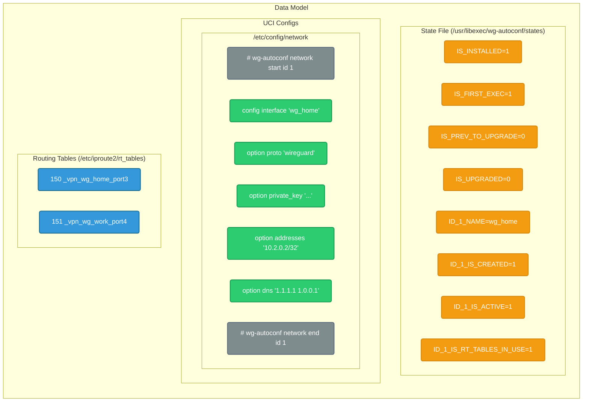

### Testing Strategy

Manual testing on:

- OpenWrt 25.12+ with APK enabled
- Multiple device architectures (x86_64, aarch64, armv7)
- Different busybox versions (1.35.0+)

### Known Limitations

1. **Single Peer per WG Interface**: WireGuard limitation, not tool
2. **No Key Rotation**: Manual updates required
3. **No Web UI**: CLI only. Pending a `luci-proto-x` module
4. **APK Only**: No Opkg version

---

## Issues

Found issues? Report at: [https://github.com/alexandrglm/openwrt_wg-autoconf/issues](https://github.com/alexandrglm/openwrt_wg-autoconf/issues)

## License

MIT License

---
