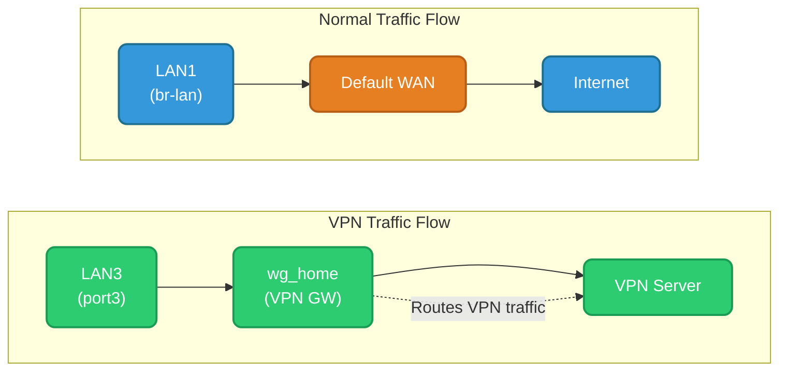

# wg-autoconf for OpenWrt

[](https://github.com/alexandrglm/openwrt_wg-autoconf)
[](https://opensource.org/licenses/MIT)
[](https://openwrt.org)

> Automated WireGuard configuration and management tool for OpenWrt.
> Built with Ash and C for performance, reliability, and minimal dependencies.

**wg-autoconf** is a comprehensive WireGuard management tool designed specifically for OpenWrt. It automates the entire lifecycle of WireGuard interfaces, from configuration to routing, firewall integration, and server management.


- **🚀 Zero-Config Setup**: Create WireGuard interfaces from standard `.conf` files
- **🔄 Policy-Based Routing**: Route specific LANs through VPN tunnels, keep others on WAN
- **🖥️ Server Mode**: Create WireGuard servers with multiple clients
- **🔥 Firewall Automation**: Automatic zone creation, forwarding rules, and NAT
- **🛡️ DNS Management**: Automatic DNS configuration with leak prevention
- **💾 State Persistence**: Tracks interface state across reboots and upgrades
- **🔧 C Optimised Core**: Performance-critical operations in C for speed
- **📦 APK Package**: Native OpenWrt 25.12+ package format

### Quick Start

```bash
# 1. Install
apk add wg-autoconf

# 2. Setup a VPN client
wg-autoconf setup myvpn

# 3. Activate
wg-autoconf up wg_myvpn

# 4. Route LAN through VPN
wg-autoconf routes set wg_myvpn lan3

# 5. Verify
wg-autoconf status
```
---

## Installation

### Requirements

- OpenWrt 25.12+ with APK package manager
- `wireguard-tools` (installed automatically)
- `ip-full` or `ip-tiny` (provided by OpenWrt)

### APK Installation

```bash
# Add public key
cp wg-autoconf.rsa.pub /etc/apk/keys/

# Install package
apk update
apk add ./wg-autoconf-1.0.0-r1.apk
```

### From Source

```bash
# Clone repository
git clone https://github.com/alexandrglm/openwrt_wg-autoconf
cd openwrt_wg-autoconf

# Build
./0build.sh

# Install
apk add --allow-untrusted packages/wg-autoconf-*.apk
```

---

## Commands Reference

### Configuration Management

| Command | Description |
|---|---|
| `wg-autoconf list` | List available `.conf` files |
| `wg-autoconf test <name>` | Validate a configuration file |
| `wg-autoconf setup <name>` | Create interface from `.conf` file |
| `wg-autoconf manual` | Interactive manual setup |

### Interface Control

| Command | Description |
|---|---|
| `wg-autoconf status` | Show all WireGuard interfaces |
| `wg-autoconf status <iface>` | Show specific interface details |
| `wg-autoconf up <iface>` | Activate interface |
| `wg-autoconf down <iface>` | Deactivate interface |
| `wg-autoconf remove <iface>` | Delete interface and clean up |

### Routing

| Command | Description |
|---|---|
| `wg-autoconf routes show` | List all VPN routes |
| `wg-autoconf routes set <wg> <lan>` | Route LAN through VPN |
| `wg-autoconf routes unset <wg> <lan>` | Remove routing |

### Server Management

| Command | Description |
|---|---|
| `wg-autoconf server create` | Create WireGuard server |
| `wg-autoconf server add <srv> <user>` | Add client to server |
| `wg-autoconf server revoke <srv> <user>` | Revoke client access |
| `wg-autoconf server remove <srv>` | Delete server completely |
| `wg-autoconf server list` | List servers and clients |
| `wg-autoconf server stats <srv>` | Show server statistics |

### Backup & Recovery

| Command | Description |
|---|---|
| `wg-autoconf backups show` | List available backups |
| `wg-autoconf backups restore` | Restore configuration backups |
| `wg-autoconf backups diag [config]` | Diagnose backup issues |
| `wg-autoconf backups cleanup` | Remove old backups |

### Settings

| Command | Description |
|---|---|
| `wg-autoconf settings show` | Display current settings |
| `wg-autoconf settings set <k> <v>` | Change a setting |
| `wg-autoconf settings edit` | Edit settings file |
| `wg-autoconf settings reset` | Reset to defaults |

### Debugging

| Command | Description |
|---|---|
| `wg-autoconf debug on` | Enable debug logging |
| `wg-autoconf debug off` | Disable debug logging |
| `wg-autoconf debug show` | View debug log |
| `wg-autoconf debug live` | Tail debug log live |
| `wg-autoconf debug clear` | Clear debug logs |
| `wg-autoconf debug states` | Show state machine |
| `wg-autoconf debug network` | Show network config |
| `wg-autoconf debug firewall` | Show firewall rules |

### Cleanup

| Command | Description |
|---|---|
| `wg-autoconf clean` | Interactive cleanup |
| `wg-autoconf clean <iface>` | Remove specific interface |
| `wg-autoconf nuke` | Remove ALL WireGuard configs |

### Global Flags

```bash
--verbose, -v    Enable verbose output
--help, -h       Show help
```

---

## Use Cases

### 1. Single VPN Client

Route all traffic from a specific LAN through a VPN provider:

```bash
wg-autoconf setup nordvpn
wg-autoconf up wg_nordvpn
wg-autoconf routes set wg_nordvpn lan3
```

### 2. Multiple VPNs, Different LANs

Route different LANs through different VPN providers:

```bash
# Setup both VPNs
wg-autoconf setup us-vpn
wg-autoconf setup eu-vpn
wg-autoconf up wg_us-vpn
wg-autoconf up wg_eu-vpn

# Route LAN3 through US VPN
wg-autoconf routes set wg_us-vpn port3

# Route LAN4 through EU VPN
wg-autoconf routes set wg_eu-vpn port4
```

### 3. VPN Server with Multiple Clients

```bash
# Create server
wg-autoconf server create
# > Server: mycompany
# > Subnet: 10.0.0.0/24
# > Endpoint: vpn.example.com

# Add clients
wg-autoconf server add mycompany laptop
wg-autoconf server add mycompany phone
wg-autoconf server add mycompany tablet

# Monitor
wg-autoconf server stats mycompany
```

### 4. Policy-Based Routing

Route only specific traffic through VPN:

```bash
# Setup interface (AllowedIPs controls what goes through VPN)
wg-autoconf setup selective

# In the .conf file, set AllowedIPs to specific subnets
# AllowedIPs = 10.0.0.0/8, 172.16.0.0/12, 192.168.0.0/16

# Activate
wg-autoconf up wg_selective
```

---

## Architecture

### Components

```
wg-autoconf
├── Shell Core (wg-autoconf.source)
│   ├── CLI Interface
│   ├── State Machine
│   ├── UCI Management
│   ├── Backup System
│   └── Debug System
├── C Optimised Modules
│   ├── wg-validator      - Configuration validation
│   ├── wg-get_conf_value - Config file parsing
│   ├── wg-interface      - Interface control (up/down)
│   ├── wg-route          - Routing management
│   └── wg-setup          - Setup and removal
└── Lifecycle Scripts
    ├── preinst           - Pre-installation checks
    ├── postinst          - Post-installation setup
    ├── prerm             - Pre-removal cleanup
    └── boot_cleanup      - Boot-time cleanup service
```

### State Machine

The state machine tracks each interface through its lifecycle:

```mermaid
stateDiagram-v2
    [*] --> CREATED: setup
    CREATED --> ACTIVE: up
    ACTIVE --> ROUTED: routes set
    ROUTED --> ACTIVE: routes clear
    ACTIVE --> CREATED: down
    CREATED --> REMOVED: remove
    ROUTED --> REMOVED: remove
    REMOVED --> [*]
    
    note right of CREATED
        <b>State: CREATED</b>
        Action: setup
        Interface configured
        but not active
    end note
    
    note right of ACTIVE
        <b>State: ACTIVE</b>
        Action: up
        WireGuard interface
        is up and running
    end note
    
    note right of ROUTED
        <b>State: ROUTED</b>
        Action: routes set
        Routing rules
        are configured
    end note
    
    note right of REMOVED
        <b>State: REMOVED</b>
        Action: remove
        Interface and config
        are cleaned up
    end note
    
    classDef created fill:#F39C12,color:#fff,stroke:#D68910,stroke-width:2px,rx:8px
    classDef active fill:#2ECC71,color:#fff,stroke:#1A9C54,stroke-width:2px,rx:8px
    classDef routed fill:#3498DB,color:#fff,stroke:#1F6F8F,stroke-width:2px,rx:8px
    classDef removed fill:#E74C3C,color:#fff,stroke:#A93226,stroke-width:2px,rx:8px
    
    class CREATED created
    class ACTIVE active
    class ROUTED routed
    class REMOVED removed
```



States are stored in `/usr/libexec/wg-autoconf/states` with the format:

```
ID_1_NAME=wg_home
ID_1_IS_CREATED=1
ID_1_IS_ACTIVE=1
ID_1_IS_RT_TABLES_IN_USE=1
```

### Routing Architecture

wg-autoconf implements policy-based routing:



---

## Troubleshooting

### Interface Won't Come Up

```bash
# Validate configuration
wg-autoconf test myconfig

# Enable debug and try again
wg-autoconf debug on
wg-autoconf up wg_myconfig --verbose
wg-autoconf debug show

# Check system logs
logread | grep wg-autoconf
```

### Routes Configured But No Traffic

```bash
# Verify routing table exists
ip route show table _vpn_wg_myconfig_port3

# Check IP rules
ip rule show

# Verify interface is UP
wg show wg_myconfig

# Check firewall zones
uci show firewall | grep wg_myconfig
```

### Address Already In Use

```bash
# Find which interface has the IP
grep -r "10.2.0.2" /etc/config/network

# List all active interfaces
wg-autoconf status

# Use different IP in config file
# Edit /etc/wireguard/myconfig.conf
# Change Address to new IP
# Re-setup: wg-autoconf setup myconfig
```

### Restore From Broken State

```bash
# View available backups
wg-autoconf backups show

# Restore latest
wg-autoconf backups restore

# If that fails, nuke and restart
wg-autoconf nuke
```

---

## File Locations

```
/etc/wireguard/                       WireGuard .conf files

/etc/config/network                   Network interface configuration
/etc/config/firewall                  Firewall configuration
/etc/config/dhcp                      DHCP/DNS configuration
/etc/iproute2/rt_tables                Routing tables

/usr/libexec/wg-autoconf/             Runtime directory
├── states                            State machine file
├── user_settings                     User configuration overrides
├── debug/                            Debug logs
├── atomics/                          Atomic operation temporary files
└── configs/                          Generated server configs

/etc/init.d/wg-autoconf_boot_cleanup  Boot cleanup service
```

---

## Performance Considerations

- **Firewall reload**: ~1–2 seconds (system limitation)
- **Routes set**: ~1–2 seconds (includes firewall reload)
- **Multiple interfaces**: Minimal overhead (each has own routing table)
- **Boot cleanup**: ~5–8 seconds/interface (runs before network startup)
- **C modules**: 1000x performance improvement over pure shell

---

## Contributing

1. Fork the repository
2. Create a feature branch
3. Make your changes
4. Submit a pull request

---

### Development Setup

```bash
# Clone
git clone https://github.com/alexandrglm/openwrt_wg-autoconf
cd openwrt_wg-autoconf

# Build
./0build.sh

# Test
apk add --allow-untrusted packages/wg-autoconf-*.apk
wg-autoconf --help
```

---

## License

MIT License - see LICENSE file for details.

---
